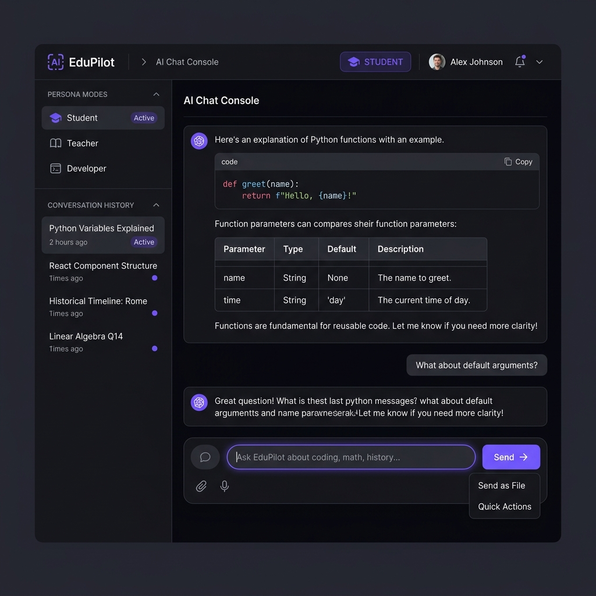
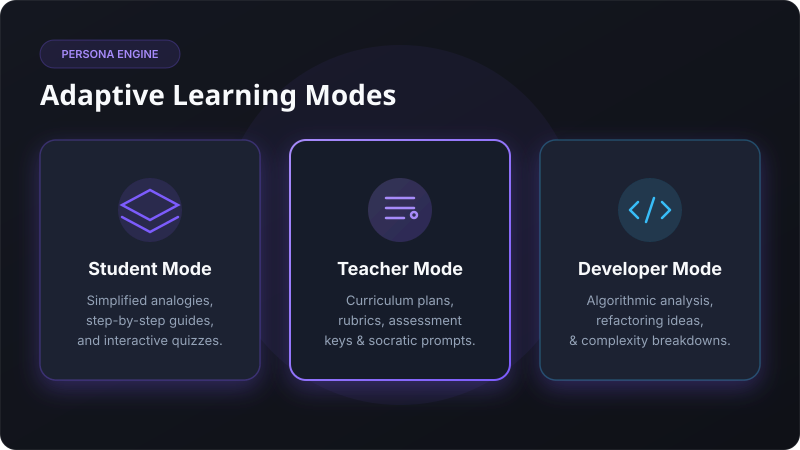
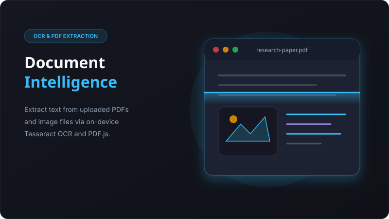
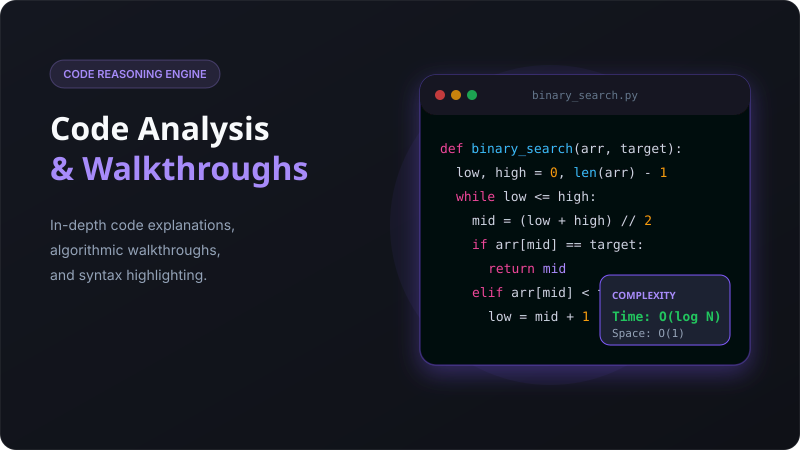

<div align="center">


<br />
<br />

### AI-Powered Educational Assistant

[](https://nodejs.org/)
[](https://expressjs.com/)
[](https://openrouter.ai/)
[](LICENSE)
[](Dockerfile)
[](CONTRIBUTING.md)

**EduPilot AI** is a production-ready, AI-powered educational assistant that connects students, teachers, and developers with state-of-the-art language models via [OpenRouter](https://openrouter.ai/). Built with a clean Express backend and a vanilla JS frontend served as a single binary — no framework overhead.

[**Live Demo**](#demo) · [**Quick Start**](#quick-start) · [**API Docs**](#api-documentation) · [**Report Bug**](https://github.com/Raghavlahoti/EduPilot-AI/issues) · [**Request Feature**](https://github.com/Raghavlahoti/EduPilot-AI/issues)

</div>

---

## Table of Contents

1. [Overview](#overview)
2. [Features](#features)
3. [Tech Stack](#tech-stack)
4. [Architecture](#architecture)
5. [Folder Structure](#folder-structure)
6. [Quick Start](#quick-start)
7. [Environment Variables](#environment-variables)
8. [Running Locally](#running-locally)
9. [Switching AI Models](#switching-ai-models)
10. [API Documentation](#api-documentation)
11. [Deployment](#deployment)
12. [Screenshots](#screenshots)
13. [Roadmap](#roadmap)
14. [Security](#security)
15. [Contributing](#contributing)
16. [License](#license)
17. [Author](#author)
18. [Acknowledgements](#acknowledgements)

---

## Overview

EduPilot AI is an educational AI assistant that wraps the [OpenRouter](https://openrouter.ai/) API to provide persona-driven conversations optimised for three audiences:

| Persona | Purpose |
|---|---|
| 🎓 **Student** | Concept explanations, analogies, flashcards, exam prep |
| 🍎 **Teacher** | Lesson plans, quiz generation, grading rubrics |
| 💻 **Developer** | Code explanation, debugging, algorithm analysis |

The active AI model is configured entirely through a single environment variable (`OPENROUTER_MODEL`). No code changes are required to switch models.

---

## Features

- ✅ **Multi-persona AI** — Student, Teacher, Developer modes with tailored system prompts
- ✅ **Any OpenRouter model** — Switch models by changing one `.env` line
- ✅ **PDF Summarisation** — Client-side PDF text extraction via PDF.js
- ✅ **Image OCR** — Tesseract.js in-browser text recognition from images
- ✅ **Voice Input** — Web Speech API with microphone permission handling
- ✅ **Prompt Templates** — Pre-built educational prompts for each persona
- ✅ **Chat History** — Sessions persisted to LocalStorage
- ✅ **Export Chat** — Download conversations as Markdown
- ✅ **Real-time Query Detection** — Honest disclosure when live web search is unavailable
- ✅ **Rate Limiting** — Express-rate-limit (100 req / 15 min per IP)
- ✅ **Helmet Security Headers** — HTTP security hardening
- ✅ **Gzip Compression** — Reduced payload sizes
- ✅ **Winston Structured Logging** — JSON in production, colourised in development
- ✅ **Docker & Docker Compose** — One-command containerised deployment
- ✅ **Health Check Endpoint** — `/api/health` for uptime monitoring

---

## Tech Stack

| Layer | Technology |
|---|---|
| Runtime | Node.js 20 LTS |
| Framework | Express 5.x |
| AI Provider | OpenRouter API (any model) |
| HTTP Client | Axios |
| Security | Helmet, CORS, express-rate-limit |
| Logging | Winston |
| Frontend | Vanilla HTML, CSS, JavaScript |
| Markdown | marked.js + DOMPurify |
| PDF Parsing | PDF.js (client-side) |
| OCR | Tesseract.js (client-side) |
| Voice | Web Speech API |
| Containerisation | Docker, Docker Compose |
| Database (optional) | MySQL 8 (falls back to memory mode) |

---

## Architecture

```
┌─────────────────────────────────────────────────────┐
│                     Browser                          │
│  ┌─────────────────────────────────────────────┐    │
│  │  Vanilla JS Frontend (index.html + script.js)│    │
│  │  • Chat UI        • Voice Input              │    │
│  │  • PDF.js OCR     • Prompt Templates         │    │
│  │  • LocalStorage   • Markdown Rendering       │    │
│  └──────────────────┬──────────────────────────┘    │
└─────────────────────┼────────────────────────────────┘
                      │ HTTP POST /chat
                      ▼
┌─────────────────────────────────────────────────────┐
│              Express Backend (Node.js 20)            │
│                                                      │
│  app.js                                              │
│  ├── Helmet (security headers)                       │
│  ├── Gzip Compression                                │
│  ├── CORS                                            │
│  ├── Morgan (HTTP logging)                           │
│  ├── Static Serving → frontend/                      │
│  ├── POST /chat                                      │
│  │   ├── rateLimiter middleware                      │
│  │   ├── validateChatPrompt middleware               │
│  │   └── chatController                             │
│  │       ├── openRouterService → OpenRouter API      │
│  │       └── database.js (optional async persist)   │
│  ├── GET /api/health                                 │
│  └── globalErrorHandler                             │
└──────────────────────┬──────────────────────────────┘
                       │ HTTPS
                       ▼
┌──────────────────────────────┐
│   OpenRouter API             │
│   model: $OPENROUTER_MODEL   │
└──────────────────────────────┘
```

**Data Flow:**

1. User submits a message in the browser
2. `script.js` sends `POST /chat` with `{ prompt, mode, customSystemPrompt }`
3. Express validates and rate-limits the request
4. `chatController` calls `openRouterService`
5. `openRouterService` detects real-time queries, applies persona system prompt, and forwards the request to OpenRouter
6. The AI reply is returned as `{ reply: "..." }` and rendered as Markdown in the browser

---

## Folder Structure

```
EduPilot-AI/
├── backend/
│   ├── src/
│   │   ├── app.js                  # Express application setup
│   │   ├── config/
│   │   │   ├── env.js              # Environment variable loader & validator
│   │   │   └── database.js         # MySQL connection pool (optional)
│   │   ├── controllers/
│   │   │   ├── chatController.js   # POST /chat handler
│   │   │   └── healthController.js # GET /api/health handler
│   │   ├── middleware/
│   │   │   ├── errorHandler.js     # Global error handler
│   │   │   ├── rateLimiter.js      # express-rate-limit configuration
│   │   │   └── validate.js         # Request body validation
│   │   ├── services/
│   │   │   ├── openRouterService.js # OpenRouter API integration
│   │   │   └── searchService.js    # Real-time query detection & web search stub
│   │   └── utils/
│   │       └── logger.js           # Winston logger
│   ├── .env.example                # Environment variable template
│   ├── package.json
│   └── server.js                   # Entry point
├── frontend/
│   ├── index.html                  # Main application shell
│   ├── login.html                  # Login page
│   ├── script.js                   # All frontend logic
│   └── styles.css                  # Design system & component styles
├── docs/
│   └── screenshots/                # Add application screenshots here
├── .github/
│   └── workflows/
│       └── ci.yml                  # GitHub Actions CI pipeline
├── .gitignore
├── .dockerignore
├── Dockerfile                      # Production Docker image
├── docker-compose.yml              # Full stack with MySQL
├── render.yaml                     # Render deployment config
├── vercel.json                     # Vercel frontend deployment config
├── CHANGELOG.md
├── CODE_OF_CONDUCT.md
├── CONTRIBUTING.md
├── LICENSE
├── README.md
└── SECURITY.md
```

---

## Quick Start

### Prerequisites

- [Node.js 20+](https://nodejs.org/)
- An [OpenRouter API key](https://openrouter.ai/keys) (free tier available)
- MySQL 8 *(optional — runs without a database)*

### 1. Clone the repository

```bash
git clone https://github.com/your-username/EduPilot-AI.git
cd EduPilot-AI
```

### 2. Install dependencies

```bash
cd backend && npm install
```

### 3. Configure environment

```bash
cp backend/.env.example backend/.env
# Edit backend/.env and add your OPENROUTER_API_KEY
```

### 4. Start the server

```bash
cd backend && npm start
```

Open **http://localhost:5000** in your browser.

---

## Environment Variables

All configuration is managed through `backend/.env`.

| Variable | Required | Default | Description |
|---|---|---|---|
| `OPENROUTER_API_KEY` | **Yes** | — | Your OpenRouter API key from [openrouter.ai/keys](https://openrouter.ai/keys) |
| `OPENROUTER_MODEL` | No | `openrouter/free` | AI model identifier. Any model from [openrouter.ai/models](https://openrouter.ai/models) |
| `PORT` | No | `5000` | HTTP server port |
| `HOST` | No | `0.0.0.0` | Host interface to bind |
| `NODE_ENV` | No | `development` | `development` or `production` |
| `DB_HOST` | No | `localhost` | MySQL host |
| `DB_PORT` | No | `3306` | MySQL port |
| `DB_USER` | No | `root` | MySQL user |
| `DB_PASSWORD` | No | *(empty)* | MySQL password |
| `DB_NAME` | No | `edupilot_db` | MySQL database name |
| `RATE_LIMIT_WINDOW_MS` | No | `900000` | Rate limit window in ms (15 min) |
| `RATE_LIMIT_MAX` | No | `100` | Max requests per window per IP |
| `LOG_LEVEL` | No | `info` | Winston log level (`debug`, `info`, `warn`, `error`) |
| `SEARCH_API_KEY` | No | — | Future: Tavily/Brave Search API key for live web search |

> **Note:** The server starts in memory-only mode if no database variables are provided.

---

## Running Locally

### Standard (Node.js)

```bash
# Install dependencies
cd backend && npm install

# Development (auto-restart on file changes)
npm run dev

# Production
npm start
```

### Docker (recommended)

```bash
# Copy and configure environment
cp backend/.env.example backend/.env

# Build and start all services
docker compose up --build

# Run in background
docker compose up -d

# View logs
docker compose logs -f edupilot-app

# Stop services
docker compose down
```

---

## Switching AI Models

No source code changes are required. Simply update `OPENROUTER_MODEL` in your `.env` file and restart the server.

```bash
# Free models
OPENROUTER_MODEL=openrouter/free
OPENROUTER_MODEL=deepseek/deepseek-chat
OPENROUTER_MODEL=google/gemma-3-27b-it:free
OPENROUTER_MODEL=meta-llama/llama-3.3-70b-instruct:free

# Paid models
OPENROUTER_MODEL=openai/gpt-4o
OPENROUTER_MODEL=anthropic/claude-3.7-sonnet
OPENROUTER_MODEL=google/gemini-2.5-flash
```

Browse available models at [openrouter.ai/models](https://openrouter.ai/models).

On startup the server logs the active model:

```
✓  OpenRouter API Key: configured
✓  OpenRouter Model:   deepseek/deepseek-chat
🚀 EduPilot AI Production Server running on http://localhost:5000
```

---

## API Documentation

Base URL: `http://localhost:5000`

---

### `GET /api/health`

Returns the current server and service health status.

**Response `200 OK`**

```json
{
  "status": "ok",
  "environment": "development",
  "timestamp": "2026-07-23T11:47:05.306Z",
  "services": {
    "openRouterApiKeyConfigured": true,
    "database": "connected"
  }
}
```

---

### `POST /chat`

Submit a prompt to the AI assistant.

**Headers**

```
Content-Type: application/json
```

**Request Body**

| Field | Type | Required | Description |
|---|---|---|---|
| `prompt` | `string` | **Yes** | User message (max 20,000 characters) |
| `mode` | `string` | No | Persona: `student` (default), `teacher`, `developer` |
| `customSystemPrompt` | `string` | No | Override the persona system prompt entirely |

**Example Request**

```bash
curl -X POST http://localhost:5000/chat \
  -H "Content-Type: application/json" \
  -d '{
    "prompt": "Explain binary search in simple terms.",
    "mode": "student"
  }'
```

**Response `200 OK`**

```json
{
  "reply": "Binary search is like looking up a word in a dictionary..."
}
```

**Error Responses**

| Status | Cause | Response |
|---|---|---|
| `400` | Missing or empty `prompt` | `{ "reply": "Invalid request: Prompt must be a non-empty string." }` |
| `400` | Prompt too long | `{ "reply": "Prompt exceeds maximum allowed length of 20000 characters." }` |
| `429` | Rate limit exceeded | `{ "reply": "Too many requests from this IP. Please try again after 15 minutes." }` |
| `500` | OpenRouter API failure / server error | `{ "reply": "An unexpected error occurred on the server." }` |

---

## Deployment

### Render

Create a [Render Web Service](https://render.com/) using the included `render.yaml`:

```bash
# render.yaml is already configured — just connect your GitHub repo on Render
# Set environment variables in the Render dashboard:
# OPENROUTER_API_KEY=<your key>
# OPENROUTER_MODEL=openrouter/free
```

### Railway

1. Push this repo to GitHub
2. Create a new project on [railway.app](https://railway.app)
3. Select "Deploy from GitHub repo"
4. Set `OPENROUTER_API_KEY` in the Railway environment settings
5. Set the root directory to `backend` and start command to `npm start`

### Vercel (Frontend only)

For a static frontend deployment:

```bash
cd frontend
vercel deploy
```

The `vercel.json` file is pre-configured.

### Docker Compose (Self-hosted)

```bash
docker compose up -d
```

---

## Screenshots

> Screenshots are located in [`docs/screenshots/`](docs/screenshots/).
### Feature Graphics & Screenshots

| Feature | Visual |
|---|---|
| **Console Interface** |  |
| **Persona Engine** |  |
| **PDF & OCR Intelligence** |  |
| **Code Reasoning Engine** |  |

---

## Roadmap

- [ ] JWT authentication with user accounts
- [ ] Server-Sent Events (SSE) streaming responses
- [ ] Tavily / Brave Search integration for live web search
- [ ] Conversation history stored server-side (MySQL)
- [ ] REST API authentication via API keys
- [ ] Plugin architecture for custom AI tools
- [ ] Dark/light theme persistence
- [ ] Multi-language support (i18n)

---

## Security

- HTTP security headers via [Helmet](https://helmetjs.github.io/)
- API rate limiting per IP (100 req / 15 min by default)
- Request body size limited to 1 MB
- Prompt length capped at 20,000 characters
- All AI output sanitised through [DOMPurify](https://github.com/cure53/DOMPurify) before DOM insertion
- Production error messages do not expose internal stack traces

To report a security vulnerability, please see [SECURITY.md](SECURITY.md).

---

## Contributing

Contributions are welcome. Please read [CONTRIBUTING.md](CONTRIBUTING.md) before opening a pull request.

```bash
# Fork and clone
git checkout -b feat/your-feature-name
# Make changes, then:
git commit -m "feat: describe your change"
git push origin feat/your-feature-name
# Open a pull request
```

---

## License

This project is licensed under the **MIT License** — see the [LICENSE](LICENSE) file for details.

---

## Author

**Raghav Maheshwari**

- GitHub: [@Raghavlahoti](https://github.com/Raghavlahoti)

---

## Acknowledgements

- [OpenRouter](https://openrouter.ai/) — unified LLM API gateway
- [marked.js](https://marked.js.org/) — Markdown parsing
- [DOMPurify](https://github.com/cure53/DOMPurify) — XSS sanitisation
- [PDF.js](https://mozilla.github.io/pdf.js/) — client-side PDF text extraction
- [Tesseract.js](https://tesseract.projectnaptha.com/) — browser-based OCR
- [Winston](https://github.com/winstonjs/winston) — structured logging
- [Helmet](https://helmetjs.github.io/) — HTTP security headers

---

<div align="center">
  <sub>Built with ❤️ by Raghav Maheshwari</sub>
</div>
